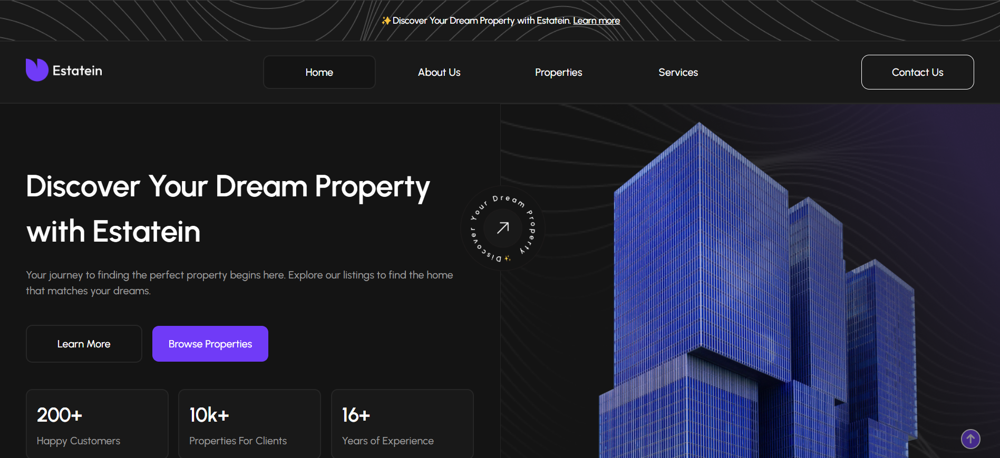

#  HavyAgency –  Estate Agency

**Full-stack (Frontend + Backend) Project**  
A modern platform for delivering up-to-date real estate information and attracting new clients.

---

## 🚀 Key Features
- Sort and manage leads from clients
- Export all collected emails for marketing
- Add, remove, and edit real estate listings
- Manage users with different permissions
- Fully responsive – accessible from any device



🔗 **[Live Demo](https://estatein.alwaysdata.net/)**  
🎨 **[Figma Design](https://www.figma.com/design/mkozkfJX2EGUIFcbl43EuD/Real-Estate-Business-Website?node-id=45-2)**  
📄 **[Admin Panel Guide](./assets/docs/ADMIN.md)**

---

## 🛠 Tech Stack
  
  
  
  
  
  


---

## 📦 Installation
1. Clone the repository:
```bash
git clone https://github.com/Alazizxan/EsteteAgensy.git
```
2. Create `.env` file based on `.env.example`
3. Install dependencies:
```bash
composer require vlucas/phpdotenv twig/twig:^3.0 symfony/var-dumper --dev
composer dump-autoload
```

---

## 📩 Contact
[](https://www.linkedin.com/in/azizkhon-pulatov-27090b372/)  
[](mailto:azikcanpapagul@gmail.com)
